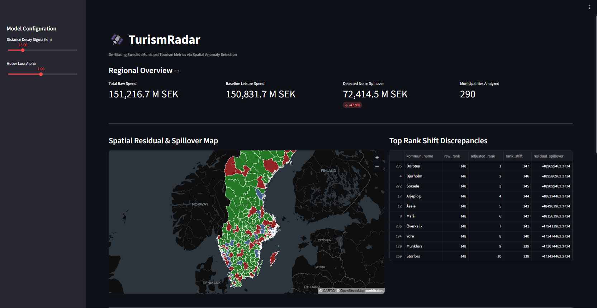
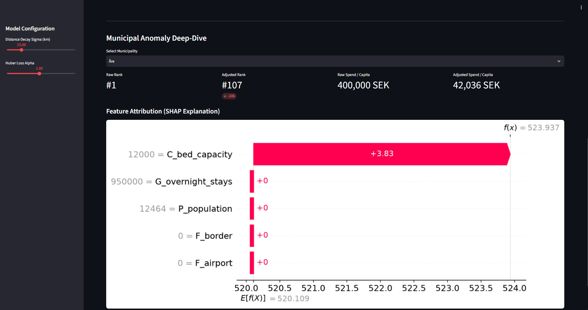

# 🛰️ TurismRadar

**De-biasing Municipal Tourism Metrics via Spatial Anomaly Detection**

TurismRadar is a geospatial machine learning engine designed to isolate genuine municipal leisure spend from economic spillover noise (such as cross-border trade and airport transit). Built using **LightGBM**, **SHAP**, **GeoPandas (EPSG:3006)**, and **Streamlit**, integrated with live **SCB PxWeb API** data and **Eurostat LAU boundaries**.

## Core Methodology
- **Live Ingestion:** Dynamically fetches municipal population and accommodation indicators from Statistics Sweden (SCB).
- **Spatial Feature Engineering:** Computes geodesic exponential decay vectors ($F = e^{-d/\sigma}$) to model border and airport proximity friction.
- **Huber Loss Optimization:** Robust regression ($\alpha = 1.0$) suppresses extreme transaction outliers without warping true destination baselines.
- **Explainability (SHAP):** Full model transparency with per-municipality feature attribution waterfall plots.

## Results 
De-biasing municipal metrics via spatial anomaly detection to prevent border trade and transit noise from skewing regional development funds. (Aligned with Tillväxtverket Inkvarteringsstatistik)





## Quickstart

```bash
# Clone repository
git clone [https://github.com/](https://github.com/)<your-username>/turismradar.git
cd turismradar

# Install dependencies
pip install -r requirements.txt

# Launch dashboard
streamlit run main.py
